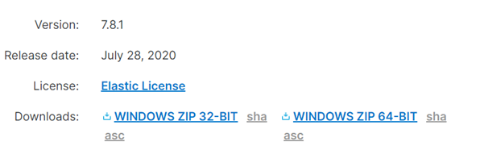

# PC Winlogbeat

## Analyze my pc winlogbeat

Installation of winlogbeat & kibana visualization
=====

**1. Winlogbeat Downlod** 

    

**2. winlogbeat.yml – output을 logstash로 설정하기**

    

**3. Configure Winlogbeat**

    

**4. Start winlogbeat**

    

**5. Log Count (2020/08/06)**

    

시간을00시부터 23시까지  설정하여 검색하였지만 9시에만 검색이되었다 이러한 이유는 추후에 분석을 하여 확인해 보려한다.

ECS Field Reference
=====
위에서 추가한 index pattern과 그 내용을 확인 했을 때 table에는 다음과 같은 filed가 나왔다 

    

따라서 이러한 filed에 따른 각각의 의미를 먼저 알아보고 차후에 진행될 프로젝트에 어떤 유의점을 가지고 해당 항목들을 필터링 할지 고민하며 해당 표를 참조하려 한다. 

ECS filed reference 홈페이지 : https://www.elastic.co/guide/en/ecs/current/ecs-field-reference.html#ecs-fieldsets

| 필드 | 의미 |비고 |
|---|:---:|---:|
| `Base` | 최상위 수준에서 직접 정의 된 모든 필드 | |
| `Agent` | 모니터링 에이전트에 대한 필드 |  |
| `Autonomous System` | 자율시스템(인터넷 라우팅 접두사)을 설명하는 필드 |  |
| `Client` | 서버와 함꼐 사용되는 네트워킄ㅇㄴ결의 클라이언트 측에 대할 필드 |  |
| `Cloud` | 클라우드 리소스에 대한 필드 |  |
| `Code Signature` | 2진 코드서명에 대한 정보 |  |
| `Container` | 해당 이벤트르르 생성한 컨테이너에 대한 설명 |  |
| `Destination` | 소스와 함꼐 사용되는 네트워크 연결의 대상측에 대한 필드 |  |
| `DLL` | 동적으로된 코드 라이브러리에 대한 정보가 포함|  |
| `DNS` | DNS 쿼리 및 답변을 설명하는 필드 |  |
| `ECS` | ECS에 특정한 메타 정보 |  |
| `Error` | 모든종류에 대한 필드 |  |
| `Event` | 이벤트 세부정보를 분류하는 필드 |  |
| `File` | 파일을 설명하는 필드 |  |
| `Geo` | 위치를 설명하는 필드  |  |
| `Gruop` | 이벤트와 관련된 사용자 그룹 |  |
| `Hash` | 해시 (일반적으로 파일 해시 ) | Hash에 대한 홈페이지 : https://wnw1005.tistory.com/261 |
| `Interrface` | Observer의 인터페이스 정보를 설명하는 필드 |  |
| `Log` | 이벤트의 로깅 메커니즘에 대한 세부 정보 |  |
| `Network` | 이벤트가 발생한 통신 경로를 설명하는 필드|  |
| `Observer` | 호스트 외부에서 이벤트를 관찰하는 엔티티를 설명하는 필드 |  |
| `Organization` | 이벤트와 관련된 조직 또는 회사를 설명하는 필드 |  |
| `Operating system` | 운영체제에 대한 정보 |  |
| `Package` | 소프트웨어 패키지에 대한 정보 |  |
| `PE` | Window PE 메타 데이터 포함 | Window PE : 윈도우 사전 설치 환경 , 윈도우 설치시에 뜨는 화면 -> 가장 기본적인 기능의 window의 기능 포함  관련 홈페이지 : https://wjdqh6544.tistory.com/163
| `Process` | 프로세스에 대한 정보 |  |
| `Registry` | Windows 레지스트리 작업과관련된 필드 |  |
| `Related` | 데이터를 중심으로 피벗을 용이하게 하기위한 필드 |  |
| `Rule` | 경고 또는 기타 주목할만한 이벤트를 생성하는데 사용되는 규칙에 대한 세부정보를 캡처하는 필드 |  |
| `Server` | 네트워크 연결의 서버측에 대한 필드 |  |
| `Service` | 데이터가 수집된 서비시를 설명하는 필드 |  |
| `Source` | 대상과 함꼐 사용되는 네트워크 연결의 소스 측에 대한 필드  |  |
| `Threat` | 위협분류에 따라 이벤트 및 경고를 분류하는 필드 |  |
| `TLS` | TLS 연결을 설명하는 필드 | TLS : 인터넷에서의 정보를 암호화해서 송수신하는 프로토콜 , TLS를 이용한 암호화된 연결을 하는 HTTP -> HTTPS , 기본포트는 80 이지만 HTTPS는 443   관련 홈페이지 https://namu.wiki/w/TLS |
| `Tracing` |  트레이싱(분산추적)과 관련된 필드|  |
| `URL` | 다앙한 형식으로 URL을 지정할 수 있는 필드 |  |
| `User` | 이벤트과 관련된 사용자를 설명하는 필드 |  |
| `User agent` | 브라ㅏ우저 user_agent 문자열을 설명하는 필드 |  |
| `VLAN` | 관찰된 VLAN 정보를 설명하는 필드  | VLAN : 가상 근거리 통신망 , 일반적으로 스위치나 라우너 장비에서 수행된다. |
| `Vulnerabilty` | 이벤트와 관련된 취약성을 설명하는 필드 |  |

실제 log 분석
=====

해당 그림을 보았을 때 그래프가 가장 높은 부분의 시간대에서 어떤 이벤트가 발생하였는지 많은 소스중에서 하나를 선택에 처음부터 끝까지 분석해보려 한다. 

    
여기서 발생한 1000개의 이벤트중 하나를 선택한 결과는 다음과 같고 해당 부분에서의 해석은 다음과 같다. 

**1. Agent filed**

| 필드 | 내용 |분석 |
|---|:---:|---:|
| `agent.ephemeral_id` | eb796aba-19d4-4b20-8788-94c0fe6272f5 | 해당 agent의 임시 식별자 , 재시작 시 변경|
| `agent.id` | 위의 내용과 같은 자리수의 다른 ID | 에이전트의 고유 식변자 |
| `agent.name` | DESKTOP-OOPD7QO | |
| `agent.type` | winlogbeat | 해당 로그의 agent는 winlogbeat이고 해당 agent의 고유 ID는 agend.id에서 확인할 수 있다. |
| `agent.version` | 7.8.1 | 해당 agent의 version은 7.8.1 이다.|

**2. event filed**

| 필드 | 내용 |분석 |
|---|:---:|---:|
| `event.action` |	Registry value set  (rule: RegistryEvent)| 이벤트에서 캡쳐한 작업이 레시트스리의 값을 set한다. (일반적으로 값은 구현자가 정의)|
| `event.code` | 13 | 이 이벤트에 대한 식변코드가 있는경우이므로  이벤트 코드 13을 사용하여 message를 명확하게 구분 , 13 : Registry value set   13코드는 레지스트르이 값을 설정하는 값이고 해당 코드가 찍힌걸로는 해당 이벤트가 발생 되었을때 사용자가 혹은 PC가 제어판 설정 파일연결, 시스템정책, 또는 설치된 소프트웨어를 번경하여 레지스트리에 반영되었을 것이다.   |
| `event.created` |Aug 6, 2020 @ 09:07:46.975| 해당 시간에 이벤트가 발생된 것으로 보인다. |
| `event.kind` |event| 이벤트 종류는 event이다.  이벤트는 event, metric, state, pipeline_error, signal 중 하나여야 하므로 정상 event이다. |
| `event.provider` |Microsoft-Windows-Sysmon| 이벤트 제공자는 Microsoft-Windows-Sysmon 이다. |

**3. message**

위의 event code에서 확인 했듯이 해당 event.code 가 13 이었고 해당 메시지는 레지스트리의 값을 변경하는 것이었다
해당 진행이 실제로 진행된 시간은 2020-05-05 17:31:38.382 였다.
TargetObject가 HKLM\SOFTWARE\Microsoft\Windows\CurrentVersion\Run\AhnLab Safe Transaction Application 였다.

**4. winlog**

winlog에 해당하는 내용을 분석하기위해서 해당 홈페이지를 참고하였다. 
Elastic Winlogbeat fileds Reference : https://www.elastic.co/guide/en/beats/winlogbeat/master/exported-fields-winlog.html

| 필드 | 내용 |분석 |
|---|:---:|---:|
| `winlog.api` |  wineventlog	| 기록을 읽는데 사용되는 로그 API유형은 wineventlog이다. |
| `winlog.channel` |	Microsoft-Windows-Sysmon/Operational| 이 기록을 읽은 채널의 이름이다.  |
| `winlog.task` |Registry value set (rule: RegistryEvent)	|이벤트에 정의된 작업이 레지스트리의 값을 설정한 것이고 이는 이벤트가 기록된 응용프로그램의 위치를 식별하는 게 사용한다.  |
| `winlog.user.domain` |NT AUTHORITY	| 해당 이벤트의 구성과 관련된 도메인이 NT AUTHORITY이고 이는 표준권한 서비스를 실행하기 위한 제한된 서비스 계정으로 네트워크를 사용하기 위한 익명의 윈도우 서비스계정이다.  |
| `winlog.user.name` |SYSTEM	| 주로 user.doamin과 관련이 있으며 NT AUTHORITY\SYSTEM 이다.  |
| `winlog.user.identifier` |S-1-5-18	| 해당 이벤트에 관련된 계정의 보안 식별자이다. |
| `winlog.user.type` |	Well known Group| 이는 S-1-5-18은 잘 알려진 보안식별자에 속에 있으며 이름은 로컬 시스템이여 운영체제에서 사용하느 서비스 계저이다. |
| `winlog.version` |2	| 이벤트 정의의 버전 번호가 2번인것으로 보아 수정이 1회 이뤄 졌다. |

결론 및 분석 결과
=====
위의 로그를 분석한 결과 나의 PC는 잘알려진 보안식별자로 네트워크를 사용하여 해당 경로에 있는 프로그램을 실행하여 접근하였고 레지스트리의 값을 설정하였다. 이로 인해 이벤트가 발생하였고 이떄 번호는 13번이었다 13은 시스템의 소프트웨서 설치 및 변경에 해당하는 메시지의 식별자이다. 레지스트리의 값 변경대상은 KLM\SOFTWARE\Microsoft\Windows\CurrentVersion\Run\AhnLab Safe Transaction Application경로에 있다.  해당경로에 있는 AhnLab Safe Transaction Application 을 검색해보았더니 
이는 annlab에서 만든 네트워크 보호프로그램이고 ActiveX를 사용하지 않는 보안모듈이다 .  은행의 금융거래를 위해서 설치된 프로그램으로 보이지만 해당 프로그램은 부팅과 동시에 실행되며 메모리 누수로 인한 성능저하 , 팅기게 만드는 이유 ,컴퓨터의 CPU부하와 성능저하, 발열, 팬의 사용량 증가, 심지어는 정상적인 파일의 다운로드 차단, 홈페이지 접근 차단등의 문제점이 발견되고 있다. <vr>사용 후 삭제하는것이 좋지만 해당 프로그램은 인터넷 뱅킹의 사용을 위해서는 필수적인 프로그램이다.

프로젝트 진행시 유의점 
=====
업무관리자는 업무자의 PC에서 어떤 프로그램을 어떤 경로로 접근하고 이는 업무의 효율을 높이는지, 또한 업무와 관계 높은 프로그램을 실행하는지 , 혹은 해가되는 프로그램을 실행하는지 확인하고 그에 맞는 업무를 
부여하는게 목적이다. 하지만 pc는 많은 응용프로그램을 실행하고 부팅과 동시에 실행되는 프로그램이 매우 많다. 

그렇다면 카카오톡, 보안프로그램, 인터넷 뱅킹관련 보안프로그램 등등..  많은 프로그램들이 PC의 부팅과 동시에 실행될것이고 해당 로그는 위와같이 쌓이게 될것이다. 
이떄 우리는 로그를 분석할 떄 필요하지 않은 데이터들은 업무자는 물론 업무 관리자의 업무에도 악영향을 미치게 되는 쓰레기 데이터가 모이게 된다. 

우리를 해당 이벤트의 번호, 그리고 해당 이벤트의 유형, API, processID, indentifier, task , action, provider, kind의 분류를 먼저 실행해야 할것이고 해당 더 깊이 들어가서는 해당 프로그램이 업무몰입도와 관련된 데이터임에도 필터링하여 걸러지지 않았는지에 대한 명확한 기준과 정의를 한 후 진행해야하고 그에 따른 데이터의 공통점을 통하여 업무의 지시가 이뤄진 다면 업무자의 업무몰입도가 증가할 것이라고 분석하였다. 

